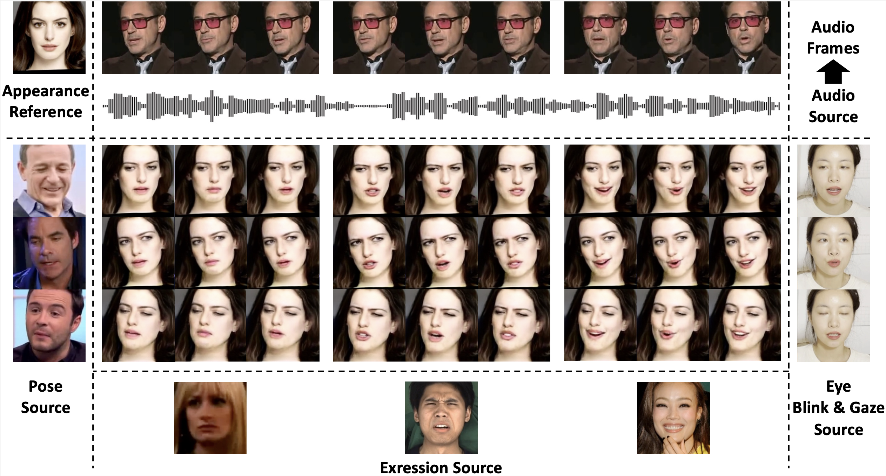
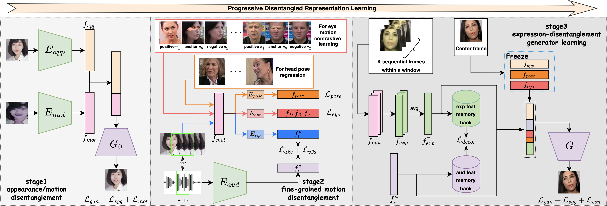

# PD-FGC: Progressive Disentangled Representation Learning for Fine-Grained Controllable Talking Head Synthesis (CVPR 2023)

[Duomin Wang](https://dorniwang.github.io/), [Yu Deng](https://yudeng.github.io/), [Zixin Yin](https://zxyin.github.io/), [Heung-Yeung Shum](https://www.microsoft.com/en-us/research/people/hshum/), and [Baoyuan Wang](https://sites.google.com/site/zjuwby/?pli=1).

### [Project](https://dorniwang.github.io/PD-FGC/) | [Paper](https://arxiv.org/abs/2211.14506) | [Demo](https://youtu.be/uSH6yweD6QU)



We present a novel one-shot talking head synthesis method that achieves disentangled and fine-grained control over lip motion, eye gaze&blink, head pose, and emotional expression. We represent different motions via disentangled latent representations and leverage an image generator to synthesize talking heads from them. To effectively disentangle each motion factor, we propose a progressive disentangled representation learning strategy by separating the factors in a coarse-to-fine manner, where we first extract unified motion feature from the driving signal, and then isolate each fine-grained motion from the unified feature. We introduce motion-specific contrastive learning and regressing for non-emotional motions, and feature-level decorrelation and self-reconstruction for emotional expression, to fully utilize the inherent properties of each motion factor in unstructured video data to achieve disentanglement. Experiments show that our method provides high quality speech&lip-motion synchronization along with precise and disentangled control over multiple extra facial motions, which can hardly be achieved by previous methods.



## Requirements
* Python 3.8.10 and [Pytorch](https://pytorch.org/) 1.7.1 are used. Basic requirements are listed in the ```requirements.txt```.

```
pip install -r requirements.txt
```


## Inference
* Download the pre-trained [checkpoints](https://drive.google.com/file/d/1UtFpTnRvUNGNSsr1LDU6W5nNtzacIB9J/view?usp=drive_link).

* Execute
```
tar -xzf checkpoints.tar
```
in ```.``` directory. There should be 4 models in checkpoints ```directory```, including ```appearance_model.pth```, ```motion_mode.pth```, ```audio_model.pth``` and ```generator_model.pth```.

* Run the demo scripts:
``` bash
bash scripts/inference.sh
```
*There are 5 arguments for input, 
1. ```--audio_path``` specifies input audio file path;
2. ```--app_img_path``` specifies input appearance image path;
3. ```--pose_path``` specifies input pose control image dir;
4. ```--exp_path``` specifies input emotional expression control image dir;
5. ```--eye_path``` specifies input eye motion control image dir.

The generated results will be save at ```test``` folder


From left to right are the *appearance*, the *generated result*,
the *pose motion video*, the *exp motion video* and the *eye motion video*.

You can specify any video as motion control source from preprocessed Voxceleb2 dataset. For you own image and video, you can take [PC-AVS](https://github.com/Hangz-nju-cuhk/Talking-Face_PC-AVS/blob/main/scripts/align_68.py)'s pre-processing as reference.

# Disentangled control
* We support disentangled control over facial motions individually through these 6 arguments,
1. ```--mouth``` specifies lip motion control is enabled;
2. ```--blink``` specifies blink control is enabled;
3. ```--gaze``` specifies gaze control is enabled;
4. ```--emo``` specifies emotional expression control is enabled;
5. ```--headpose``` specifies headpose control is enabled;
6. ```--all``` specifies all control factors are enabled.


## License and Citation

The usage of this software is under [CC-BY-4.0](https://github.com/Dorniwang/PD-FGC-inference/LICENSE).
```
@inproceedings{wang2022pdfgc,
    title={Progressive Disentangled Representation Learning for Fine-Grained Controllable Talking Head Synthesis},
    author={Wang, Duomin and Deng, Yu and Yin, Zixin and Shum, Heung-Yeung and Wang, Baoyuan},
    booktitle={Proceedings of the IEEE/CVF Conference on Computer Vision and Pattern Recognition (CVPR)},
    year={2023}
}

```

## Acknowledgement
* The appearance encoder is borrowed from [PC-AVS](https://github.com/Hangz-nju-cuhk/Talking-Face_PC-AVS).
* The generator is borrowed from [stylegan2-pytorch](https://github.com/rosinality/stylegan2-pytorch).
* The audio encoder is borrowed from [voxceleb_trainer](https://github.com/clovaai/voxceleb_trainer).
